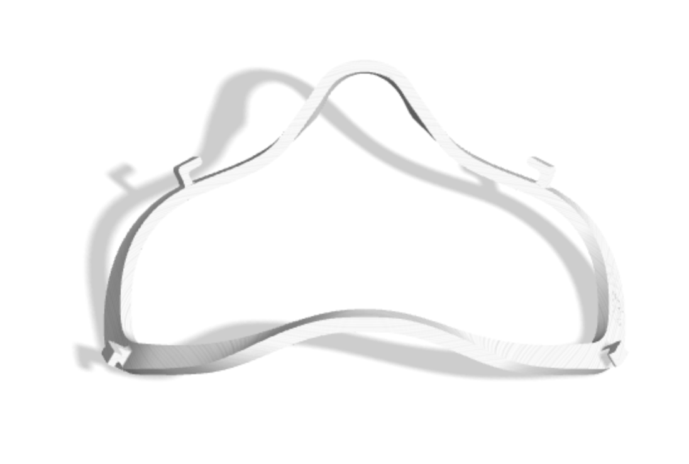
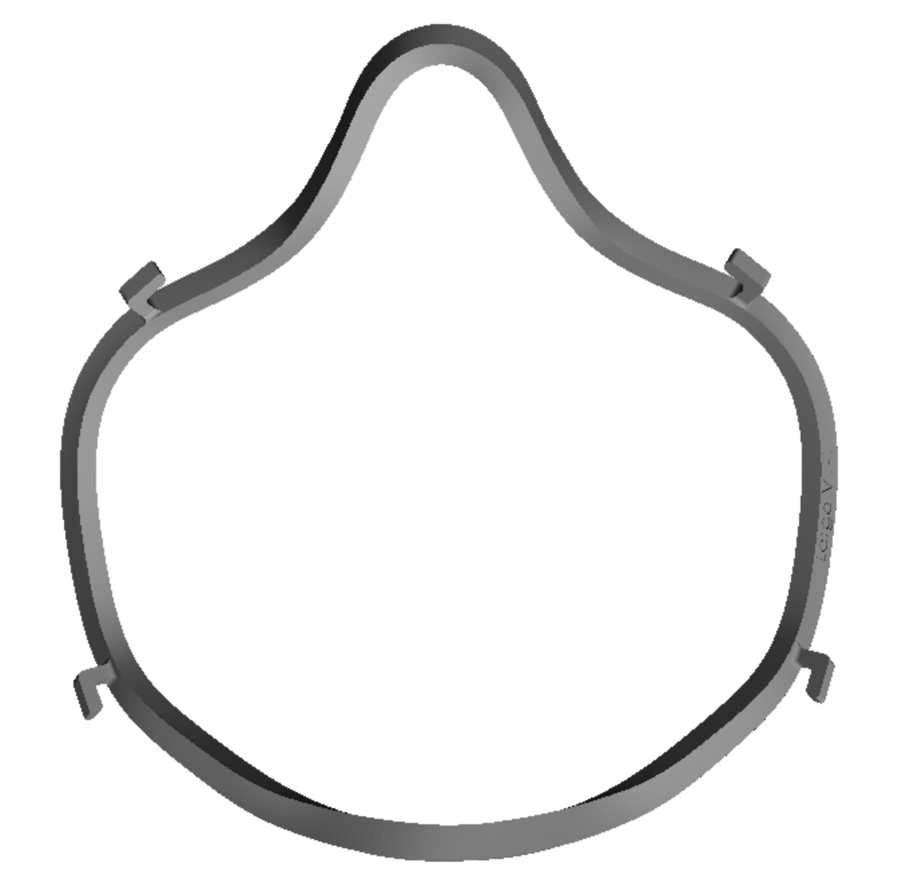

# Tetra Fitra
Contains the STLs for a fitment device for N95

This fitment device is to be worn over an N95 mask, and improves the fitment of those devices dramatically.  Published at: [https://pubmed.ncbi.nlm.nih.gov/33852548/](https://pubmed.ncbi.nlm.nih.gov/33852548/).

# Images

Sample use case of Fitra over a comercial mask

### 3D Printing Previews

